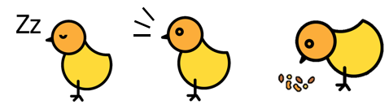
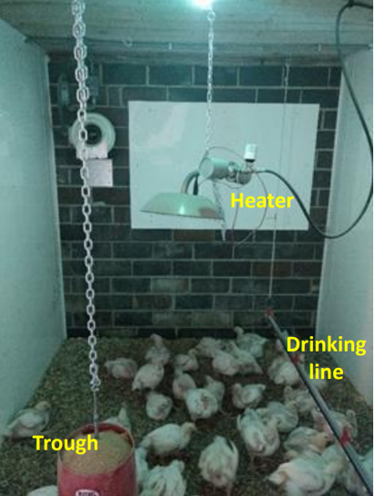
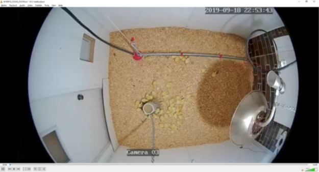
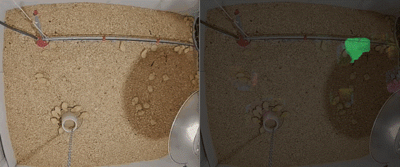
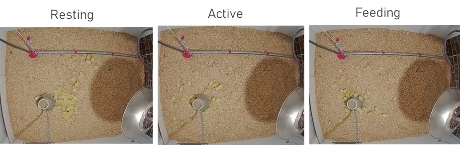
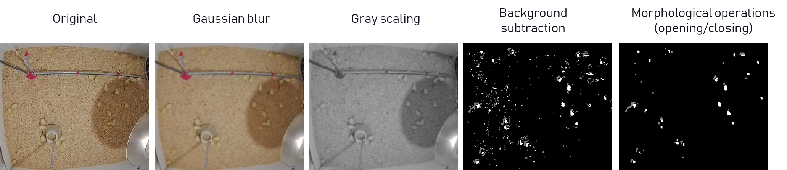
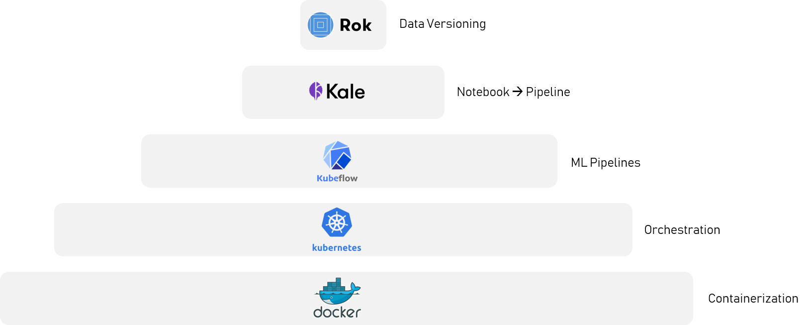
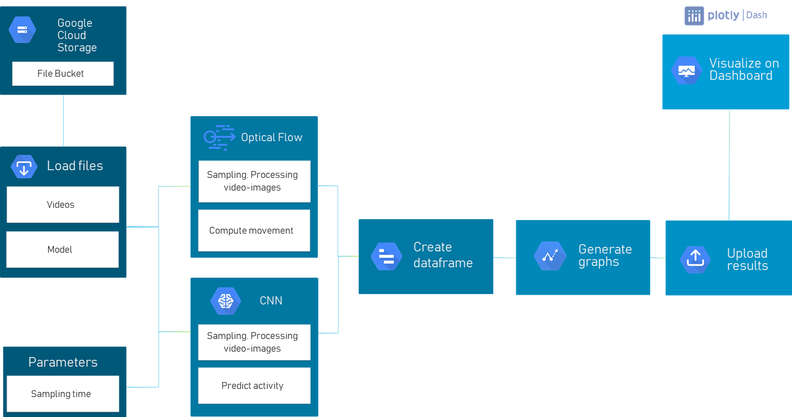
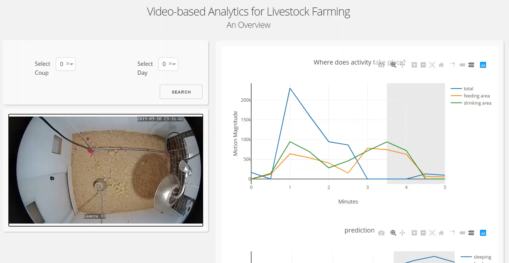

# JADS Case Study: Automating Chicken Behaviour Detection from Video Surveillance
_Module:_ Data Engineering

_Team_: Eelke Bakker, Gabriella Mansur, Negar Yaghoubihamraz, Nikos Vyzas

## Challenge

### What
Create light recipes to enable optimal chicken growth and wellbeing through lighting manipulation.

### How
Automate the detection of chicken behaviour and activity (resting, awake, eating).

### Set up
The chicken coop set-up consists of a feeding through, a drinking line, an a heater.

### Data

The full dataset consists of videos from surveillance cameras:
* 10 coups of around 4m²
* 50 chickens per coup
* Complete broiler growth cycle monitored (day 1 to 56)

For this case study, we focused specifically in a **single coup**, for the cycle part of **1-4 days**.

## Methodology

The methodology consists of an ensemble of two techniques, in order to efficiently tackle two different aspects:
* Optical flow, for optimal **movement** monitoring;

* Resnet-50 CNN architecture, for optimal **position** monitoring. The Resnet-50 is pre-trained on Imagenet weights, and thus fine-tuned to our dataset. 

We also performed data pre-processing, as illustrated below.

## Pipeline

### Software stack

### Pipeline

## Data Product
Dashboard design concept

## Conclusions
* Successfully automated the classification of chicken behaviour
* Developed pipeline connecting data source to end product
* Designed the conceptual dashboard, where user can interface with results

## Recommendations and ideas for future work
* Implementation and test of pipeline
* Add temperature as variable and monitor if it influences behaviour
* Add more training data to increase accuracy of results
* Set clear threshold and improve image labelling to better define each activity (eating, active, resting)
* Experiment with other image classification algorithms (R-CNN, YOLO, other CNN architectures)
